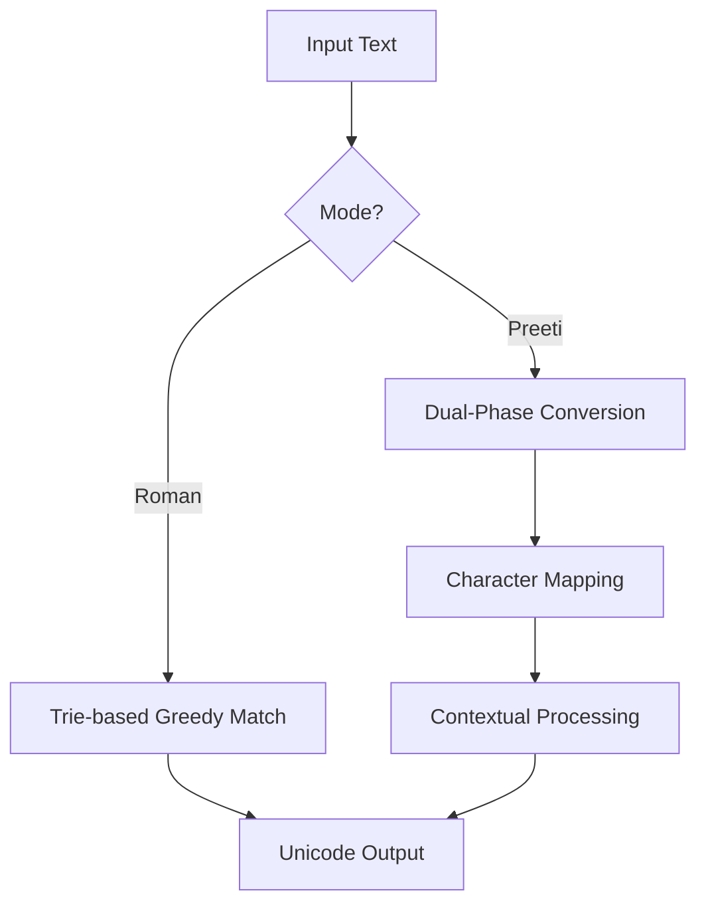

# Nepali Unicoder Documentation

Welcome to the official documentation for **Nepali Unicoder**, a robust Python package for converting Romanized Nepali text and Preeti font text into Unicode Devanagari script.

## Overview

Nepali Unicoder provides tools to handle the complexities of Devanagari script conversion, including contextual rules for Preeti font and a greedy matching algorithm for Roman transliteration.

## Documentation Sections

-   :material-rocket-launch:{ .lg .middle } __[Getting Started](./usage.md)__

    ---

    Learn how to install and use the package via CLI and Python API.

-   :material-keyboard-variant:{ .lg .middle } __[Preeti Mappings](./preeti_mappings.md)__

    ---

    A comprehensive guide to Preeti character mappings and rules.

-   :material-api:{ .lg .middle } __[API Reference](./api_reference.md)__

    ---

    Technical details about the project's classes and methods.

## How it Works

- **Greedy Phonetic Matching**: Prioritizes longer matches for more accurate Roman-to-Unicode conversion.
- **Extensive Preeti Support**: Over 40+ mappings and contextual rules (reph, matras, combined forms).
- **English Block Support**: Use `{}` to preserve English text within converted strings.
- **Custom Overrides**: Add custom word-level mappings via `word_maps.json`.
